TRONプログラミングコンテスト2025の開発環境・ツール部門に応募する【μT-Kernel × AIの学習環境】の操作マニュアルです。

# 環境構築
## 必要機材　
### micro:bit v2.21

### ライントレースロボット
こちらのロボットを使用します。

* 製品名: micro:bit用ロボットベース（ラインセンサー）
* 製品URL: https://switch-education.com/products/microbit-robobase-linesensor/
* 販売会社: 株式会社スイッチエデュケーション
* 購入製品型番: micro:bit用ロボットベース（ラインセンサー）【組立済】
  * 型番：SEDU-079617
  * 販売価格：9,000円（税込9,900円）
  ※ 組立てが必要になるが、micro:bit用ロボットベース（ラインセンサー）【未組立】（型番: SEDU-069724）でも良い。

### USBケーブル　マイクロB-A
* 長さ: 2m以上
※ ライントレースで楕円のコースで強化学習する際にケーブルが短いと捻れてしまうため、2m以上のUSBケーブルを推奨とする。

### 単3電池
* 個数: 3個
  * ライントレースロボットのDCモーターを駆動するために必要

### ライントレースのコースを印刷した紙
ライントレースするコースを印刷します。

例えば以下のテストコースがあります。下記のテストコースをA3サイズで印刷します。

https://www.robofarm.jp/microbitLesson/maqueenentry/img/testcourse.pdf

## ツールのインストール
開発に必要なツールは以下です。
インストールはパーソナルメディア株式会社の連載記事 **micro:bitでµT-Kernel 3.0を動かそう**（以降、連載記事）の[［第2回］開発ツールの準備とµT-Kernel 3.0](http://www.t-engine4u.com/info/mbit/2.html)のコンパイルのとおりにします。

記事はWindowsでのインストールが前提ですが、筆者はmacOS 13.7.8（macOS Ventura）にインストール、動作確認しました。

| No | 名称 | 概要 | バージョン | インストール参考先 |
| :--- | :--- | :--- | :--- | :--- |
| 1 | Eclipse IDE for<br>Embedded C/C++ Developers | micro:bitの統合開発環境 | 2022-03 | http://www.t-engine4u.com/info/mbit/2.html |
| 2 | GNU Arm Embedded Toolchain | ArmマイコンのGNU Cコンパイラおよび関連ツール一式 | 10.3-2021.10 | 1と同じ |
| 3 | xPack Windows Build Tools | ビルドのためのWindows用のツール一式 | 4.3.0-1 | 1と同じ |
| 4 | Python | プログラミング言語Python | 3.10.5 | 1と同じ |
| 5 | pyOCD | Python上で動作する<br>Armマイコン用のデバッグツール | 0.36.0 | 1と同じ |
| 6 | Neural Network Console | ・ニューラルネットワークの設計、学習、評価を行うためのWindows対応GUIアプリケーション<br>・ロボットの転倒状態推定モデル作成で利用する | v3.40 | https://github.com/sony/neural-network-console/tree/main/document/ja<br>インストールの章を参照 |


## ビルド
ビルド手順は以下です。

### micro:bit用µT-Kernel 3.0のソースコードのダウンロード
micro:bit用µT-Kernel 3.0のソースコードをダウンロードします。
連載記事の[［第2回］開発ツールの準備とµT-Kernel 3.0のコンパイル](http://www.t-engine4u.com/info/mbit/2.html)の下部 **■ micro:bit用µT-Kernel 3.0のソースコードのダウンロード** 記載のURLからソースコードをダウンロードします。
同じ場所に書いてあるパスワードでダウンロードした圧縮ファイルを任意の場所に解凍します。

### 開発対象【μT-Kernel × AIの学習環境】のソースコードのダウンロード
開発対象【μT-Kernel × AIの学習環境】のソースコードをダウンロードします。
ダウンロードURLはこちらです。

https://github.com/grace2riku/mtkernel_3_microbit

上記URLのCodeボタンを押下し、Download ZIPを選択します。
zipファイルを解凍したらすべてのディレクトリ(app_sample, build_make, device, nnc)をmicro:bit用µT-Kernel 3.0のソースコードのディレクトリ配下(mtkernel_3)に上書きコピーします。

### Eclipseでプロジェクトを作成
連載記事の[［第2回］開発ツールの準備とµT-Kernel 3.0のコンパイル](http://www.t-engine4u.com/info/mbit/2.html)の **（6） EclipseにµT-Kernel 3.0のプロジェクトを作成**を参照し、Eclipseでプロジェクトを作成します。

### コンパイルとビルド
連載記事の[［第2回］開発ツールの準備とµT-Kernel 3.0のコンパイル](http://www.t-engine4u.com/info/mbit/2.html)の **（7） Eclipseの操作によるコンパイルとビルド**を参照し、コンパイル・ビルドをおこないます。

## 書込み
連載記事の[［第3回］µT-Kernel 3.0の実行](http://www.t-engine4u.com/info/mbit/3.html)の **［Step-3］micro:bit実機へのµT-Kernel 3.0の転送と実行**を参照し、ビルドしたプログラムをmicro:bitに書き込みます。
端末ソフトでエンターキーを押し、>が表示されればソフトウェアは動作しています。


## ボード接続（逆挿し注意）
micro:bit、ライントレースロボットが電源オフの状態で接続します。
ライントレースロボットが電源オフの状態は下図です。

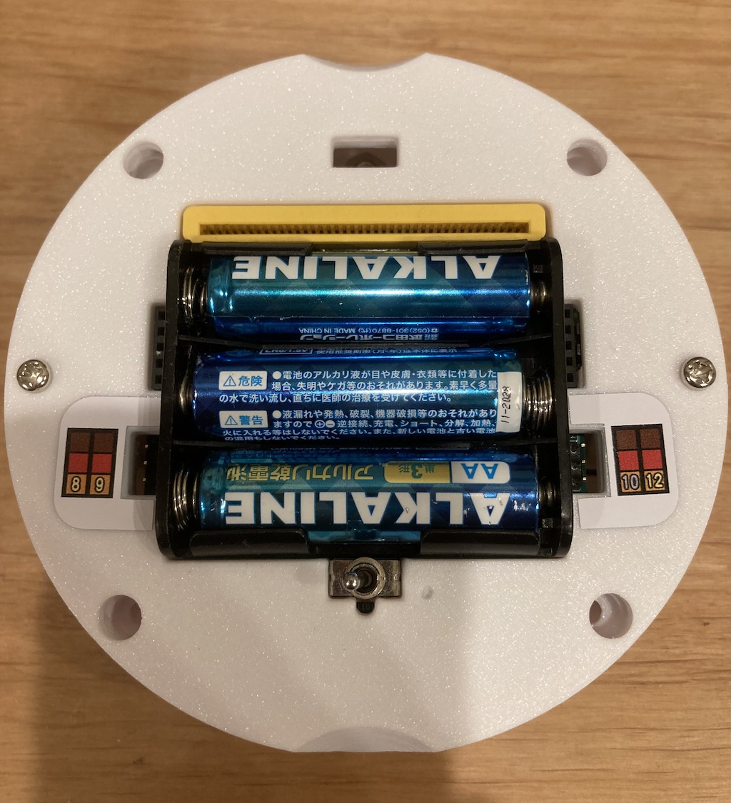

ライントレースロボットが電源オンの場合は下図のように

1. スイッチが丸いくぼみ側にある
2. LEDが点灯している

となっています。電源オンになっていないことを確認してください。

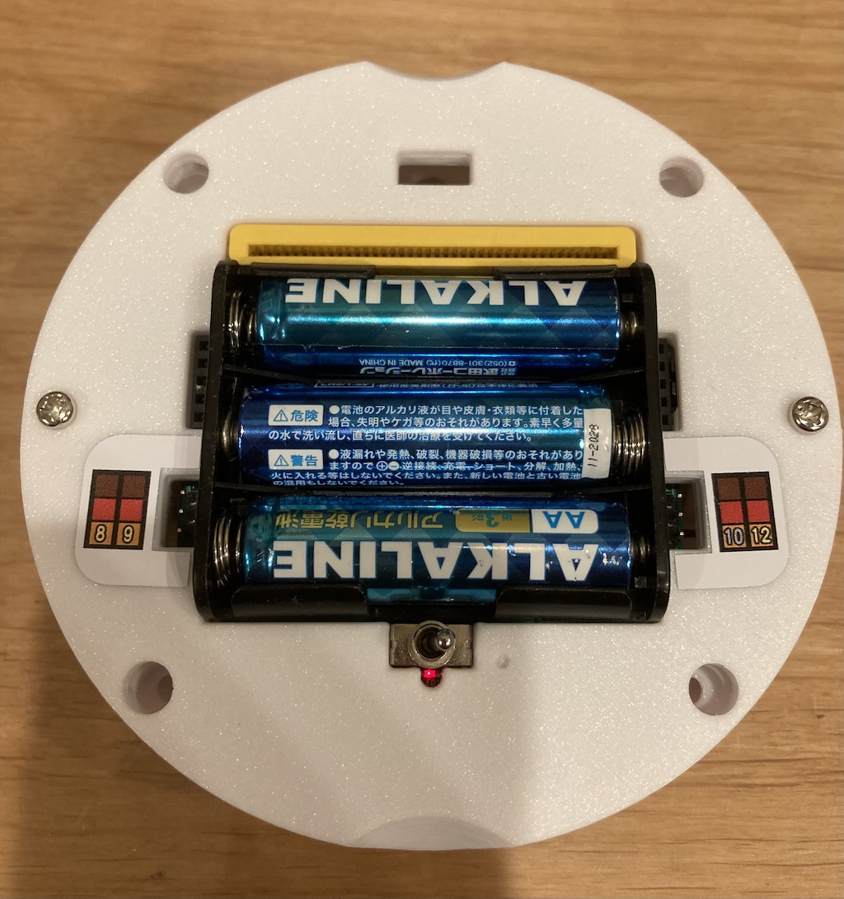

micro:bitとライントレースロボットの接続は向きがあります。
下図のようにmicro:bitをライントレースロボットに接続してください。
ライントレース走行時はmicro:bitのロゴが書いてある方向を前として進みます。
モーターを駆動してロボットを走らせたい場合は単3電池3個をセットし、スイッチを丸いくぼみ方向に倒して電源オンしてください。電源ONになるとスイッチ下のLEDが点灯します。

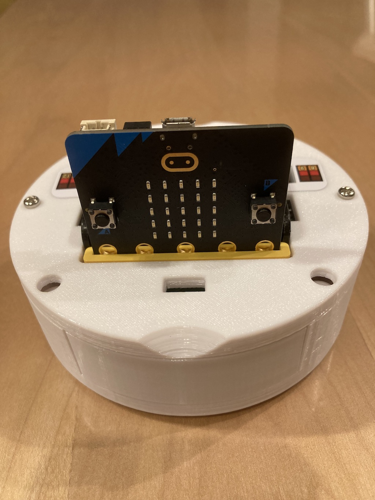

micro:bitは下図のように逆向きでライントレースロボットに接続できてしまうため注意してください。

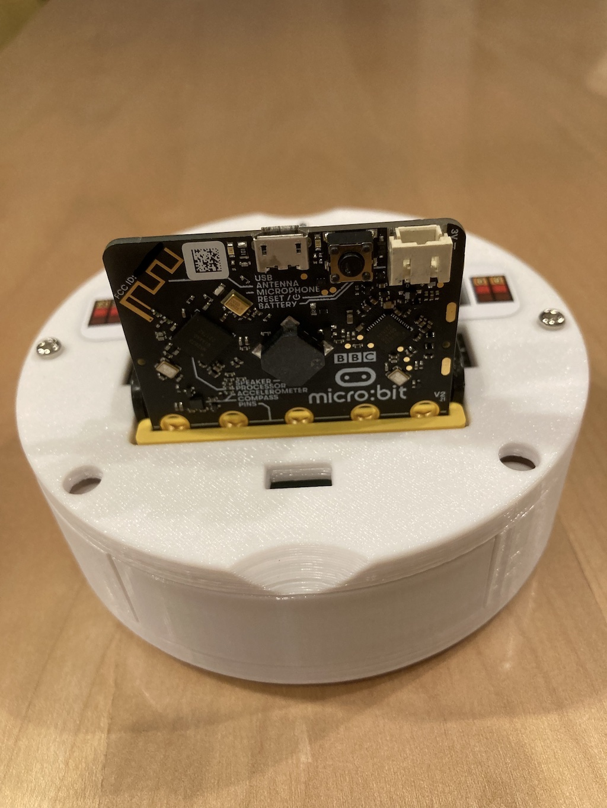

　
# 動作確認方法
## 端末ソフト接続
【μT-Kernel × AIの学習環境】は端末ソフトからコマンドを実行することで動きます。
まず端末ソフトと接続します。
端末ソフトはお好きなソフトを使ってください。WindowsだとTeratermを使うことが多いと思います。私はmacOSでminicomを使用しています。

micro:bitはライントレースロボットに接続します。USBケーブルのマイクロBコネクタをmicro:bitに接続し、タイプAコネクタをPCに接続します。
PCでmicro:bitの通信ポート名を確認します。

```
$ ls /dev/cu.usb*
/dev/cu.usbmodem14102
```

下記はminicomの表示です。micro:bitが/dev/cu.usbmodem14102で認識されています。Windowsであれば、デバイスマネージャーのポート(COM と LPT)でCOMポート番号を確認できます。

確認した通信ポート名で通信速度115200(bps)で端末ソフトと接続します。通信速度以外の設定は以下のとおりです。

* データ長 : 8bit
* パリティ : なし
* ストップビット : 1 bit
* フロー制御 : なし 

```
$ minicom -D /dev/cu.usbmodem14102 -b 115200

Welcome to minicom 2.8

OPTIONS:
Compiled on Jan  4 2021, 00:04:46.
Port /dev/cu.usbmodem14102, 22:29:24

Press Meta-Z for help on special keys

```

端末ソフトと接続後にエンターキーを押します。>が表示されればプログラムは動作しています。

```

Welcome to minicom 2.8

OPTIONS:
Compiled on Jan  4 2021, 00:04:46.
Port /dev/cu.usbmodem14102, 22:29:24

Press Meta-Z for help on special keys


>
```

## 主要機能1. ライントレース
ライントレースを動作確認します。

* micro:bitとライントレースロボットを接続します。ライントレースロボットのスイッチを電源オンします（丸いくぼみの方向にたおす）。
* ライントレースロボットをコースを印刷した紙の上に置きます。
**ライントレースロボットは赤丸部分付近をライン上に置いてください**（赤丸部分の下にフォトリフレクターがついており、黒ラインの検出をしています）。

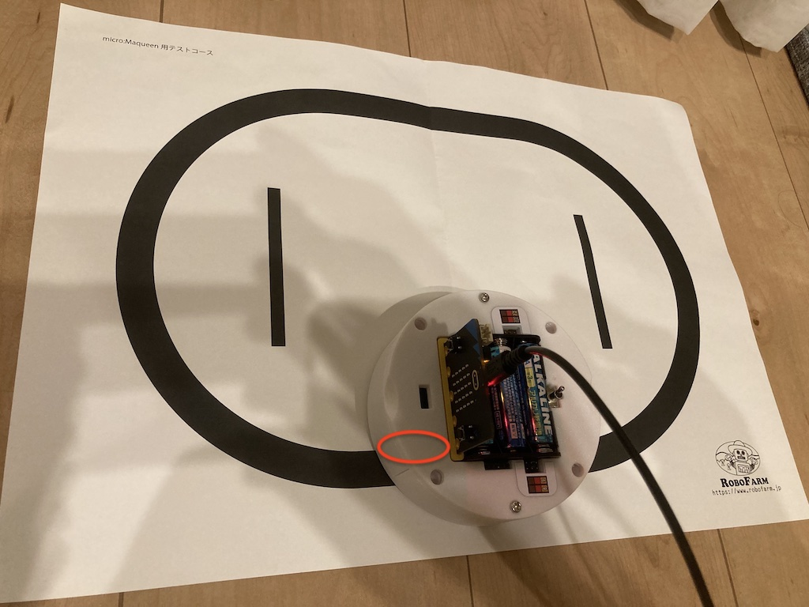

* micro:bitとPCをUSBケーブルで接続します
* 端末ソフトを接続後に以下のコマンドを入力します。

```
>trrun
```

* コマンド実行でロボットがライン上をトレースしながら走行開始します。USBケーブルがくるくるとねじれないように注意します。必要に応じてUSBケーブルをさばいて捻れないようにガイドしてください。

* ライントレースの停止は端末ソフトでtrstopを実行してください。ライントレースが停止します。

```
>trstop
```


## 主要機能2. 強化学習
ライン上の走行を繰り返し、強化学習します。強化学習で得たライントレース走行のための政策（Qtable値）を使用し、実際にライントレースします。

※micro:bitの電源オンで筆者が動作環境で強化学習し得たQtableに初期化しています。
強化学習が不要な場合は、コンパイル・ビルド、書き込み後に[強化学習の政策実行](#強化学習の政策実行)を実施してください。
強化学習の一連の流れを確認したい場合は[現在のQtable値の出力](#現在のQtable値の出力)を実施してください。

### 現在のQtable値の出力
現在のQtable値を確認するコマンドはrloutqtblです。
以下はrloutqtbl実行時の画面表示です。

```
>rloutqtbl
Qtable[0][0] = -49.403526
Qtable[0][1] = -97.823532
Qtable[0][2] = -113.177238
Qtable[1][0] = -113.157005
Qtable[1][1] = -108.166664
Qtable[1][2] = -89.119911
Qtable[2][0] = -72.646233
Qtable[2][1] = -33.338005
Qtable[2][2] = -106.562347
Qtable[3][0] = -129.607758
Qtable[3][1] = -142.625000
Qtable[3][2] = -164.059372

rlsetqtbl command setting format
rlsetqtbl -49.403526 -97.823532 -113.177238 -113.157005 -108.166664 -89.119911 -72.646233 -33
.338005 -106.562347 -129.607758 -142.625000 -164.059372
```

### 強化学習
ライン上の走行を繰り返し、強化学習を開始するコマンドはrlです。
以下の準備をしてからコマンドを実行します。

* micro:bitとライントレースロボットを接続します。ライントレースロボットのスイッチを電源オンします（丸いくぼみの方向にたおす）。
* ライントレースロボットをコースを印刷した紙の上に置きます。
* micro:bitとPCをUSBケーブルで接続します
* 端末ソフトを接続後にrlを入力します。強化学習を開始します。
* 強化学習の過程でライントレースロボットがラインを外れて停止することがあります。その際は以下のメッセージが表示されます。

```
rl_learning_task() enter tk_wai_flg() waiptn = RL_TRAIN_RESUME
Place the robot on the line and then press the B button.
```

このメッセージはライントレースロボットをライン上に置いてmicro:bitに実装されているBボタンを押すことを意味しています。micro:bitのBボタンを押すとライントレースロボットは強化学習を再開します。

* 強化学習していると端末ソフトに以下の表示が出ていることがあります。
強化学習の試行は1000回おこないます。試行回数100回ごとに以下のメッセージを出力するようにしています。強化学習の進捗の参考にしてください。

```
rl_learning_task() trial count = 100...
```

* 強化学習を終了すると端末ソフトに以下のメッセージが表示されます。

```
rl_learning_task() trial count = 1000
Qtable[0][0] = -473.137268
Qtable[0][1] = -574.839478
Qtable[0][2] = -193.743423
Qtable[1][0] = -113.157005
Qtable[1][1] = -108.166664
Qtable[1][2] = -89.119911
Qtable[2][0] = -72.646233
Qtable[2][1] = -33.338005
Qtable[2][2] = -106.562347
Qtable[3][0] = -654.267578
Qtable[3][1] = -656.989014
Qtable[3][2] = -667.952393

rlsetqtbl command setting format
rlsetqtbl -473.137268 -574.839478 -193.743423 -113.157005 -108.166664 -89.119911 -72.646233 -
33.338005 -106.562347 -654.267578 -656.989014 -667.952393
```

これで強化学習は完了です。強化学習の政策実行のコマンドを実行すると強化学習で得たQtableでライントレースします。


### 強化学習の政策実行
強化学習で得た政策（Qtable）でライントレースを実行します。
コマンドはrlactです。以下の準備をしてからコマンドを実行します。

* micro:bitとライントレースロボットを接続します。ライントレースロボットのスイッチを電源オンします（丸いくぼみの方向にたおす）。
* ライントレースロボットをコースを印刷した紙の上に置きます。
* micro:bitとPCをUSBケーブルで接続します。
* （必要であれば）強化学習のコマンド（rl）を実行し、強化学習します。
* 端末ソフトを接続後にrlactを入力します。強化学習で得た政策（Qtable）でライントレースを実行します。
* ライントレースを停止するにはmicro:bitに実装されているBボタンを押します。


### 強化学習で得た政策を書込み
強化学習で得た政策（Qtable）を永続化したい場合はつぎの手順をおこない、Qtableの初期値を変更します。
現状、Qtableの初期値は筆者が過去におこなった強化学習で得たQtableを設定しています。

* 強化学習（rlコマンド）実行後に表示されたQtable値、強化学習後に現在のQtable値の出力（rloutqtblコマンド）で表示されたQtable値で以下の変数を書き換える

  * mtkernel_3/app_sample/reinforcement_learning.c
rl_set_example_Qtable_memcpy関数内部のexample_Qtable

```c:reinforcement_learning.c
void rl_set_example_Qtable_memcpy(void) {
	float example_Qtable[Q_TABLE_STATES_NUM][Q_TABLE_ACTIONS_NUM];

	// 20250809 強化学習で得た政策でライントレースできたときのQtable値
	example_Qtable[0][0] = -49.403526;
	example_Qtable[0][1] = -97.823532;
	example_Qtable[0][2] = -113.177238;
	example_Qtable[1][0] = -113.157005;
	example_Qtable[1][1] = -108.166664;
	example_Qtable[1][2] = -89.119911;
	example_Qtable[2][0] = -72.646233;
	example_Qtable[2][1] = -33.338005;
	example_Qtable[2][2] = -106.562347;
	example_Qtable[3][0] = -129.607758;
	example_Qtable[3][1] = -142.625000;
	example_Qtable[3][2] = -164.059372;

	rl_Qtable_memcpy(example_Qtable);
}
```

* コード修正後、コンパイル・ビルドしmicro:bitにプログラムを書込みます。

電源オン後はQtableがこの関数で設定されている値になります。

## 主要機能3. 転倒状態の推論
ライントレースロボットの転倒状態を推論します。

※micro:bitの電源オンで転倒状態の推論は可能です。手っ取り早く転倒状態の推論を確認したい場合はコンパイル・ビルド、書き込み後に[転倒状態の推論](#転倒状態の推論)を実施してください。
学習データ取得、NNCでの学習・評価、コード出力の一連の流れを確認したい場合は[学習データ取得](#学習データ取得)以降の手順を実施してください。

### 学習データ取得
ライントレースロボットの転倒状態はmicro:bitに着いている加速度センサーでおこないます。
推論する転倒状態は5つです。

1. 転倒なし

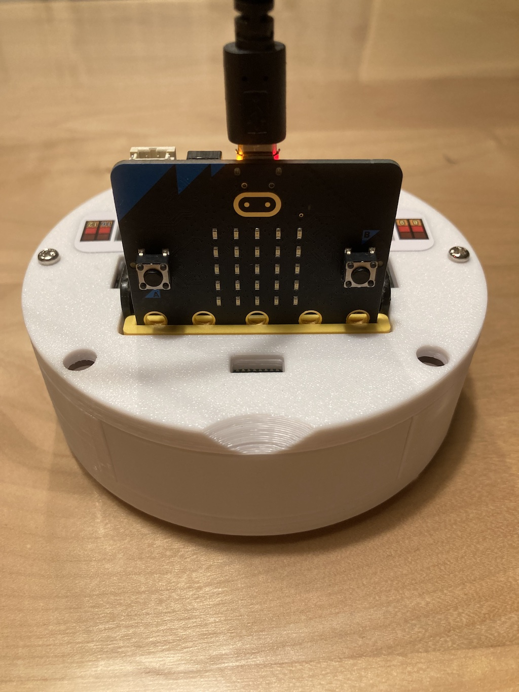

2. 右に倒れている

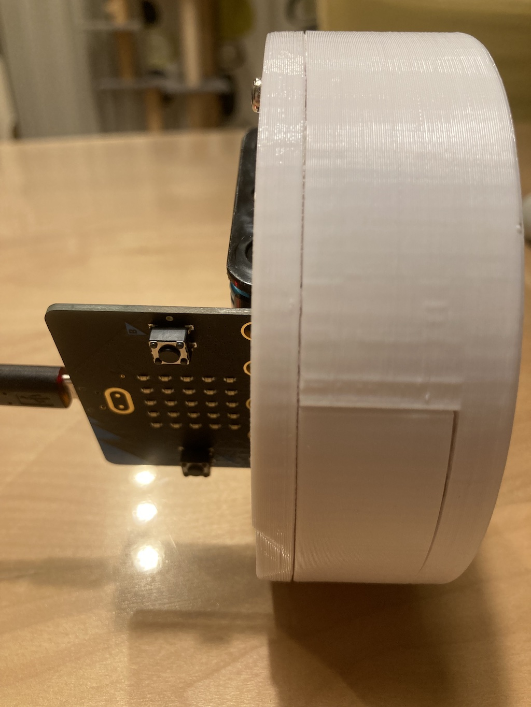

3. 左に倒れている

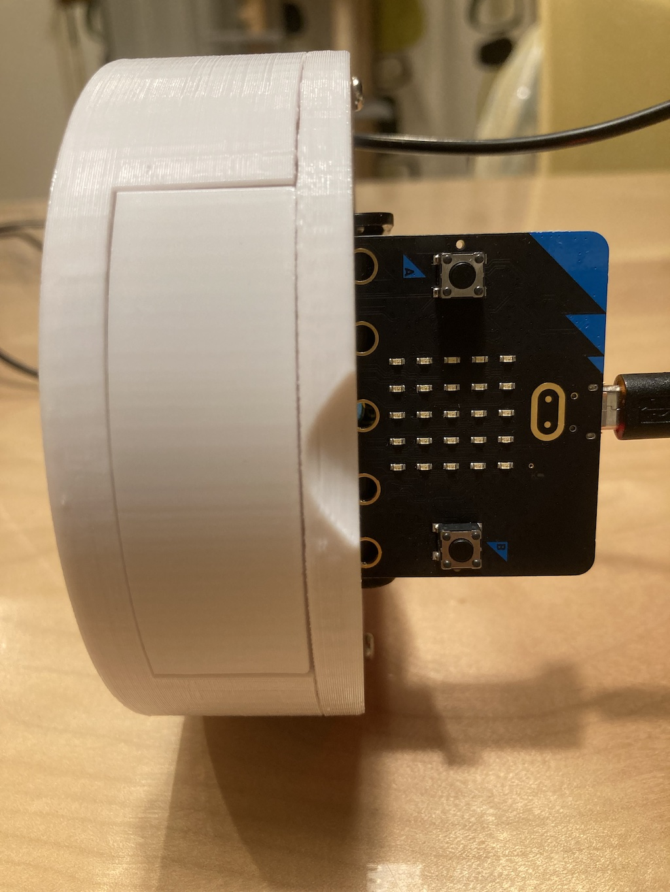

4. 前に倒れている

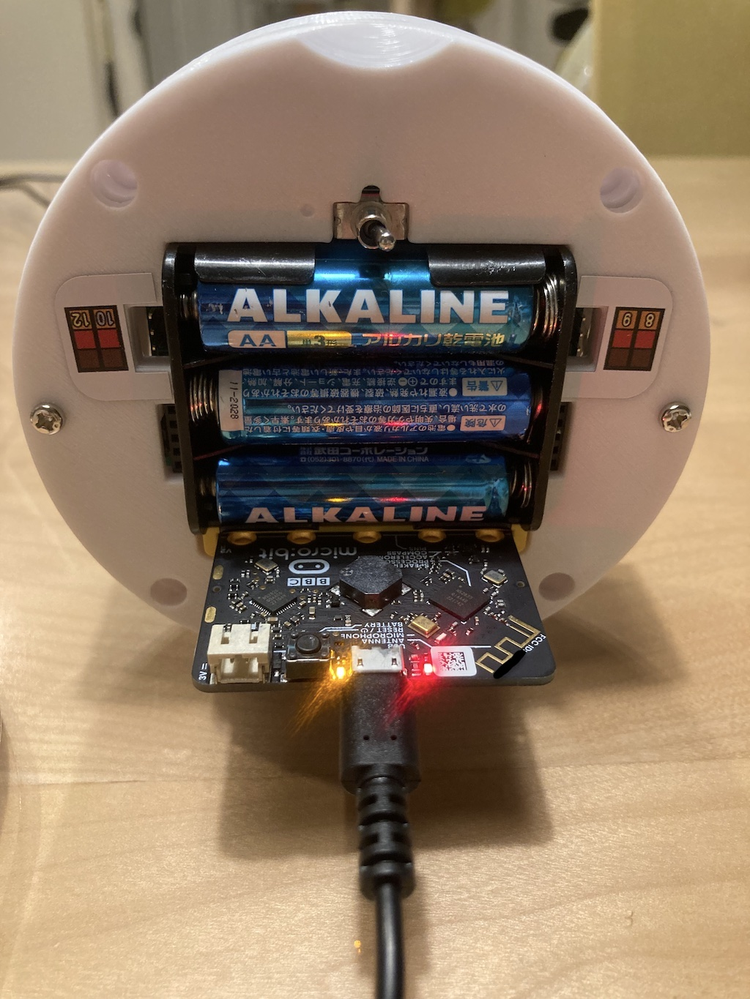

5. 後に倒れている

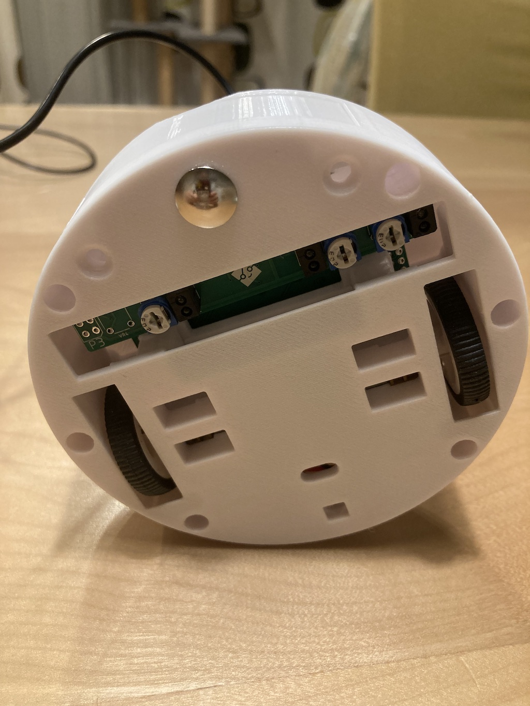

ライントレースロボットの姿勢を変えて端末ソフトでreadaccglpと入力します。
以下は転倒なしの姿勢でreadaccglpを実行した場合です（先頭の表示部分のみを抽出し転記しています）。

```
>readaccglp
-0.060000,-1.036000,-0.012000
-0.052000,-1.040000,-0.036000
-0.052000,-1.036000,-0.020000
-0.052000,-1.036000,-0.020000
-0.052000,-1.036000,-0.020000
-0.044000,-1.036000,-0.024000
-0.044000,-1.036000,-0.016000
-0.048000,-1.028000,-0.016000
-0.052000,-1.040000,-0.024000
-0.048000,-1.040000,-0.020000
-0.056000,-1.036000,-0.024000
-0.056000,-1.040000,-0.020000
-0.048000,-1.032000,-0.020000
-0.052000,-1.028000,-0.028000
-0.048000,-1.028000,-0.028000
-0.044000,-1.040000,-0.032000
```

各姿勢の加速度センサー値を10秒間取得します。
readaccglpで取得したデータはcsvファイルで保存しておきます。


### 学習データ整形
NNCに入力する学習データにするために以下の手順をおこない、csvファイルを整形します。

#### 不要な文字、空行の削除
前の章の手順で各姿勢の加速度センサー値を取得しcsvファイルに保存しました。
csvファイルが下記のようにnnc/tr_data/1_rawディレクトリに保存されている前提で続きの手順を説明をします。

```
nnc
├── nnc_model
├── nnc_project
│   └── nnc_project.sdcproj
└── tr_data
    ├── 1_raw
    │   ├── back.csv
    │   ├── front.csv
    │   ├── left.csv
    │   ├── normal.csv
    │   └── right.csv
    ├── 2
    │   └── 
    └── script
        ├── csv_add_header_and_label.py
        ├── csv_clean.py
        ├── csv_concat_keep_first_header.py
        └── csv_shuffle_split.py
```

readaccglpで取得したデータは不要な文字（>や>で始まる行）や空行などNNCの学習に不要なデータが含まれています。
この不要なデータを以下のスクリプトを実行し削除します。
変更後のファイルはnnc/tr_data/2ディレクトリに保存します。

```
cd nnc/tr_data/script/
python csv_clean.py -i ../1_raw/normal.csv -o ../2/normal.csv
python csv_clean.py -i ../1_raw/right.csv -o ../2/right.csv
python csv_clean.py -i ../1_raw/left.csv -o ../2/left.csv
python csv_clean.py -i ../1_raw/front.csv -o ../2/front.csv
python csv_clean.py -i ../1_raw/back.csv -o ../2/back.csv
```

#### ヘッダ行、ラベルの追加
前の章の手順で不要なデータを削除しました。
csvファイルが下記のようにnnc/tr_data/2ディレクトリに保存されている前提で続きの手順を説明をします。

```
nnc
├── nnc_model
├── nnc_project
│   └── nnc_project.sdcproj
└── tr_data
    ├── 2
    │   ├── back.csv
    │   ├── front.csv
    │   ├── left.csv
    │   ├── normal.csv
    │   └── right.csv
    ├── 3
    │   └── 
    └── script
        ├── csv_add_header_and_label.py
        ├── csv_clean.py
        ├── csv_concat_keep_first_header.py
        └── csv_shuffle_split.py
```

NNCで学習・評価するためにはヘッダ行とラベルが必要なので追加します。
ヘッダはファイルの1行目に記述する以下の内容です。

```
x__0,x__1,x__2,label_id
```

左からx軸重力加速度(g)、y軸重力加速度(g)、z軸重力加速度(g)、転倒状態を示すラベルです。
ラベルは以下のルールとして各csvファイルに設定します。

* 転倒なし=0, 右に転倒=1, 左に転倒2, 前に転倒=3, 後ろに転倒=4

ヘッダ行、ラベル追加を以下のスクリプトを実行し対応します。
変更後のファイルはnnc/tr_data/3ディレクトリに保存します。

```
cd nnc/tr_data/script/
python csv_add_header_and_label.py -label 0 -i ../2/normal.csv -o ../3/normal.csv
python csv_add_header_and_label.py -label 1 -i ../2/right.csv -o ../3/right.csv
python csv_add_header_and_label.py -label 2 -i ../2/left.csv -o ../3/left.csv
python csv_add_header_and_label.py -label 3 -i ../2/front.csv -o ../3/front.csv
python csv_add_header_and_label.py -label 4 -i ../2/back.csv -o ../3/back.csv
```

#### ファイル結合
前の章の手順でヘッダ行、ラベルを追加しました。
csvファイルが下記のようにnnc/tr_data/3ディレクトリに保存されている前提で続きの手順を説明をします。

```
nnc
├── nnc_model
├── nnc_project
│   └── nnc_project.sdcproj
└── tr_data
    ├── 3
    │   ├── back.csv
    │   ├── front.csv
    │   ├── left.csv
    │   ├── normal.csv
    │   └── right.csv
    ├── 4
    │   └── 
    └── script
        ├── csv_add_header_and_label.py
        ├── csv_clean.py
        ├── csv_concat_keep_first_header.py
        └── csv_shuffle_split.py
```

転倒状態は5ファイルですが、NNCの操作手順が楽になるように1ファイルに結合します。
以下のスクリプトを実行し対応します。
変更後のファイルはnnc/tr_data/4ディレクトリに保存します。

```
python csv_concat_keep_first_header.py -i ../3/normal.csv -i ../3/right.csv -i ../3/left.csv -i ../3/front.csv -i ../3/back.csv -o ../4/all_posture.csv
```

#### シャッフル、学習・評価ファイルへ分割
前の章の手順で各状態のcsvファイルを1ファイルに結合しました。
csvファイルが下記のようにnnc/tr_data/4ディレクトリに保存されている前提で続きの手順を説明をします。

```
nnc
├── nnc_model
├── nnc_project
│   └── nnc_project.sdcproj
└── tr_data
    ├── 4
    │   └── all_posture.csv
    ├── 5
    │   └── 
    └── script
        ├── csv_add_header_and_label.py
        ├── csv_clean.py
        ├── csv_concat_keep_first_header.py
        └── csv_shuffle_split.py
```

NNCの学習データは全データの80%、評価データは20%にして、データをシャッフルしたらどうかとChatGPTからアドバイスをもらいました。
以下のスクリプトを実行すると学習用データのcsvファイル（train_seed_20250924_1.csv）はall_posture.csvの80%のデータ量でシャッフルされ出力されます。評価データのcsvファイル（val_seed_20250924_1.csv）はall_posture.csvの20%のデータ量でシャッフルされ出力されます。

--seed 20250924オプションを指定しているのは再度スクリプトを実行したときに同じ出力結果にしたいためです。--seedオプションを指定しないとスクリプトを実行するたびに毎回違う出力結果になります。

変更後のファイルはnnc/tr_data/5ディレクトリに保存します。

```
python csv_shuffle_split.py -i ../4/all_posture.csv -tp 80 -ot ../5/train_seed_20250924_1.csv -ov ../5/val_seed_20250924_1.csv --seed 20250924
```

NNCは出力された学習用データのcsvファイル（train_seed_20250924_1.csv）、評価データのcsvファイル（val_seed_20250924_1.csv）を使用し、学習・評価します。

### NNCで学習
インストールしたNNCを起動します。
初回起動時はプラグイン更新の表示となるかもしれませんが、しばらくすると以下の画面になります。

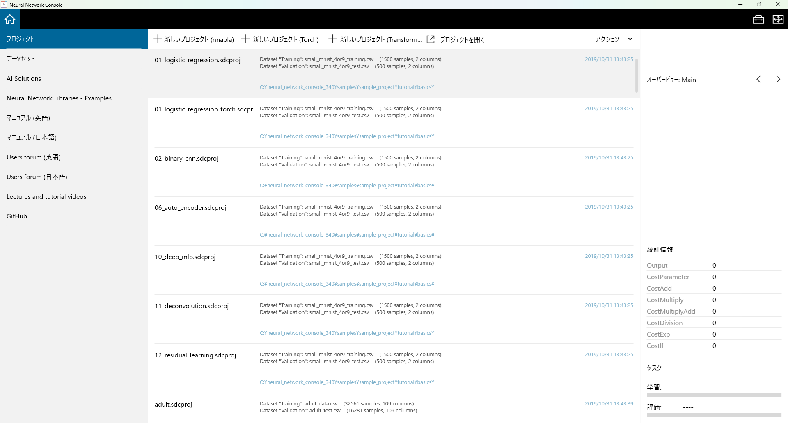

既存のプロジェクトを開くを選択します。

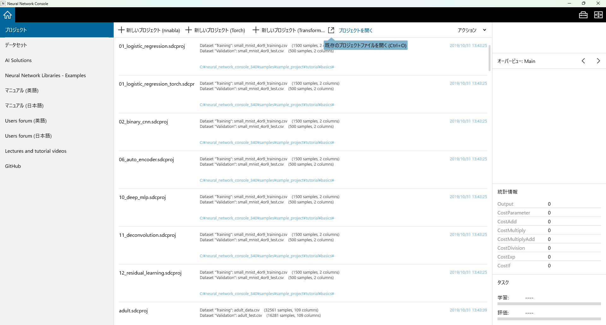

NNCのプロジェクトnnc/nnc_project/nnc_project.sdcprojを開きます。

```
nnc
├── nnc_model
├── nnc_project
│   └── nnc_project.sdcproj
└── tr_data
    └── script
```

プロジェクトを開くと以下の画面になります。

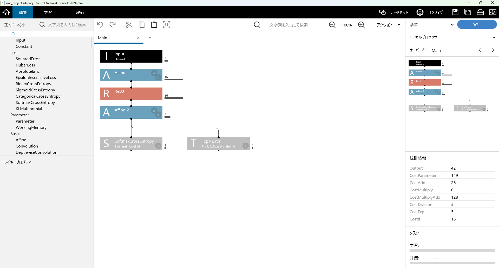

右上のデータセットを選択します。以下の画面になります。

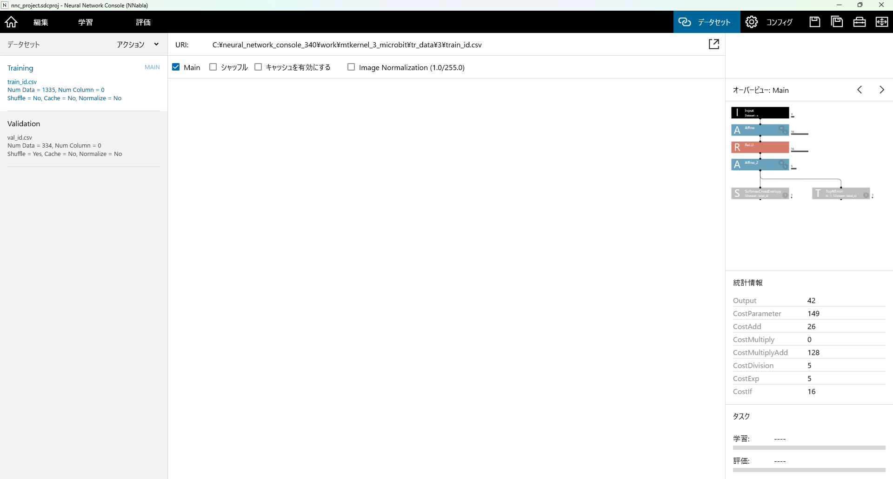

データセット画面でデータセットを開くを選択します。

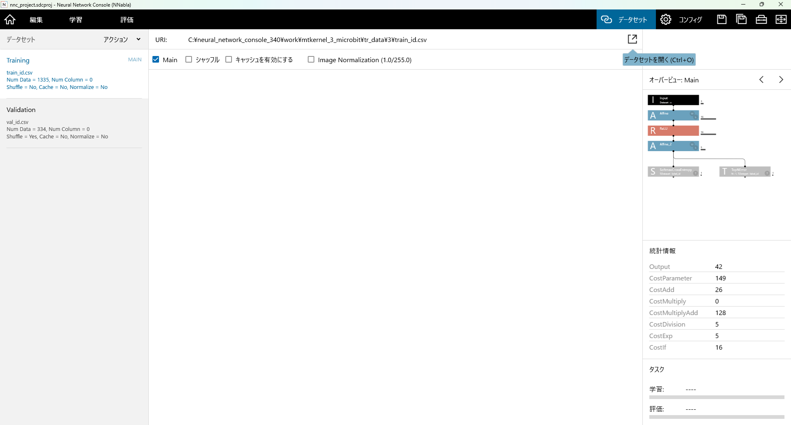

以下の画面になり、データセットが表示されます。

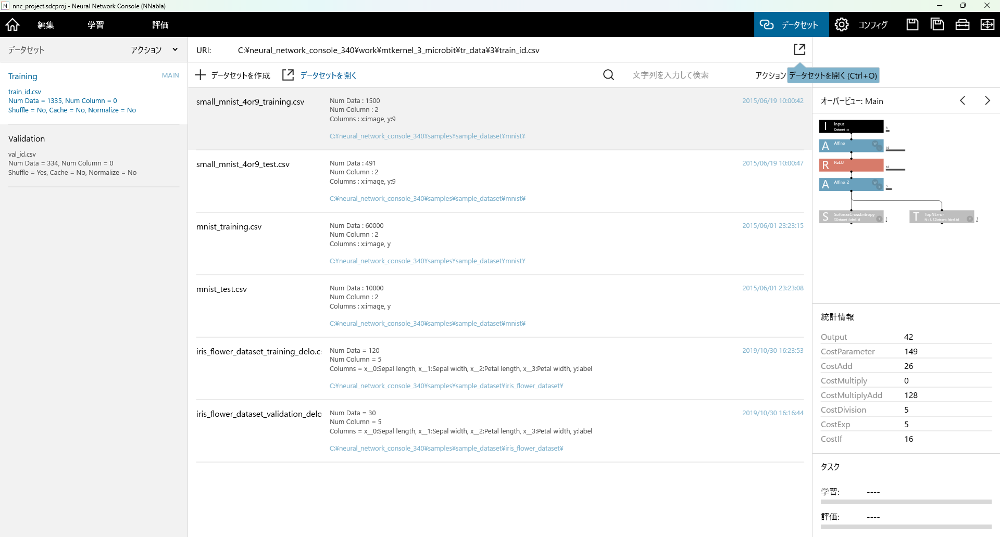

左側のTrainingを選択し、データセットを開くを選択します。
学習用のデータ（train_seed_20250924_1.csv）を開きます。

```
nnc
├── nnc_model
├── nnc_project
│   └── nnc_project.sdcproj
└── tr_data
    └── 5
        ├── train_seed_20250924_1.csv
        └── val_seed_20250924_1.csv
```

学習用のデータを開くと以下の画面になります。

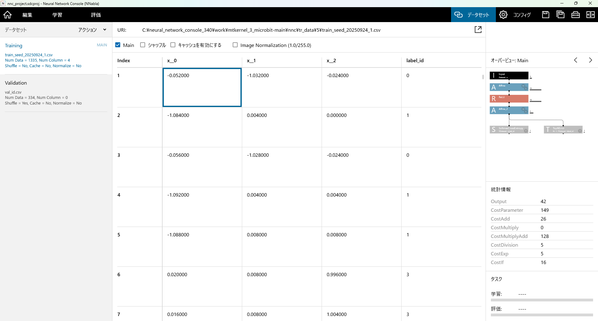

評価用のデータ（val_seed_20250924_1.csv）も学習用データと同様にデータセットを開きます。
左側のValidationを選択し、データセットを開くを選択します。
評価用のデータを開くと以下の画面になります。

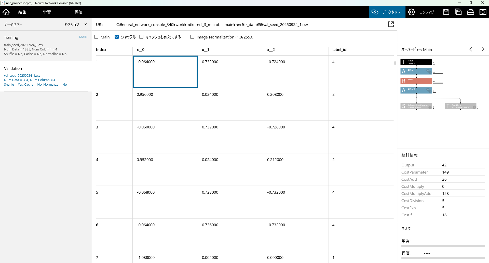

編集タブに移動します。
右側の実行ボタンを押します。

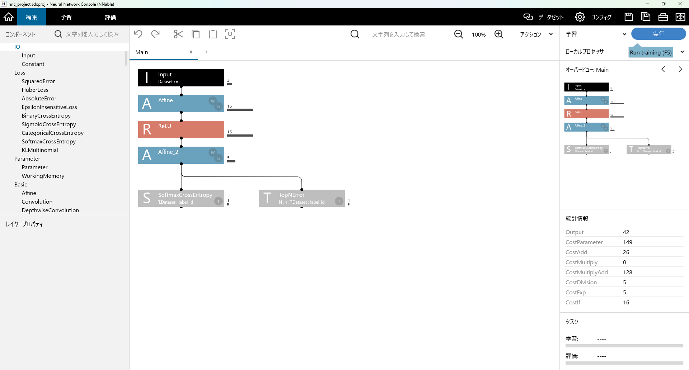

実行ボタンを押すと学習タブに画面遷移し、学習が始まります。
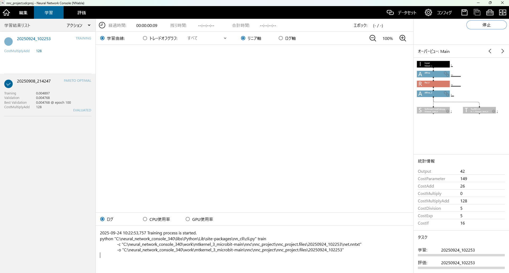

下のメッセージ表示エリアに**Training Completed**と表示されていれば学習が完了しています。
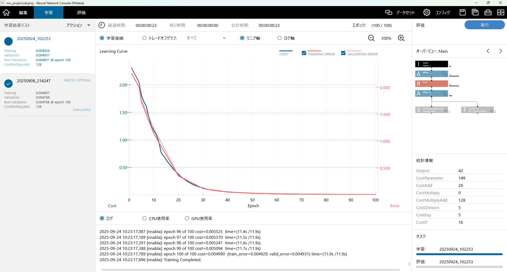

### NNCで評価
学習が完了した状態で学習タブの右側の評価エリアの実行を押します。
評価がはじまります。

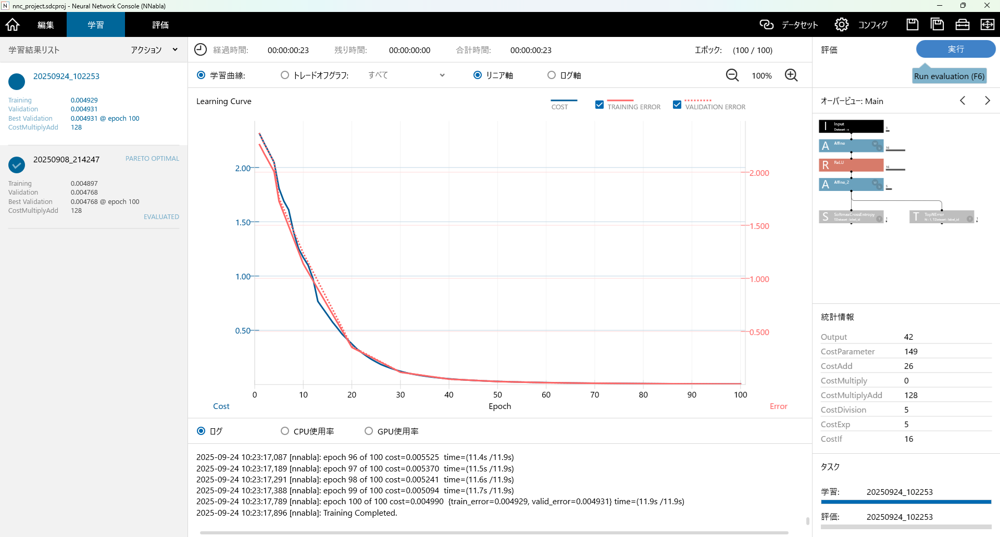

評価が完了すると評価タブに画面遷移し以下の画面になります。
.png)

混同行列を選択すると以下の画面になります。
縦軸が正解のラベルの値、横軸が推測した結果のラベルの値です。
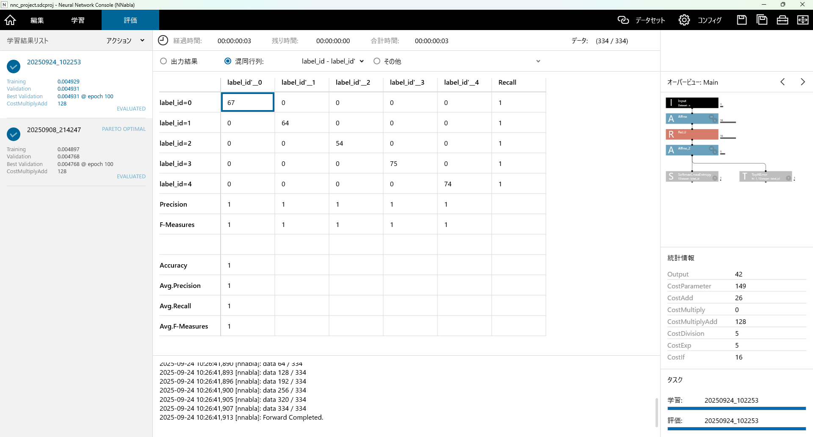

画面から以下がわかります。
* ラベル0（転倒なし）は、ラベル0と推測された個数は67個でラベル0以外と推測された個数は0
* ラベル1（右に転倒）は、ラベル1と推測された個数は64個でラベル1以外と推測された個数は0
* ラベル2（左に転倒）は、ラベル2と推測された個数は54個でラベル2以外と推測された個数は0
* ラベル3（前に転倒）は、ラベル3と推測された個数は75個でラベル3以外と推測された個数は0
* ラベル4（後に転倒）は、ラベル4と推測された個数は74個でラベル4以外と推測された個数は0

正解ラベルと推測したラベルがマトリクスになっているのでエラーの傾向が把握しやすいです。

### NNCでコード出力
学習・評価が問題なくできているのでコードを出力します。

評価タブの学習結果リストから該当するリスト（以下の画面の場合は20250924_102253）の上で右クリックし、エクスポート -> NNB（NNabla C Runtime file format）を選択します。

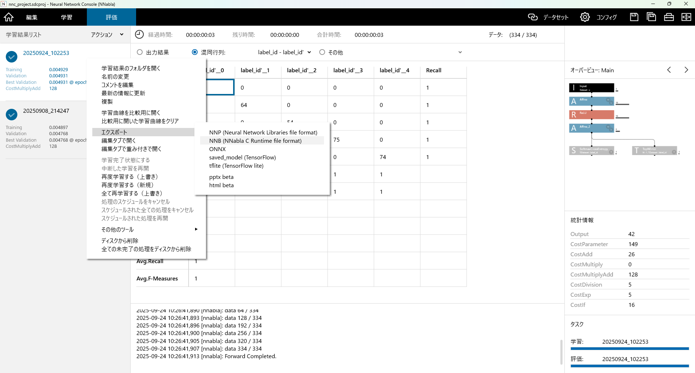

NNCのプロジェクト（拡張子*.sdcproj）と同じディレクトリ階層のnnc_project.filesディレクトリ以下にNNCの評価タブ -> 学習結果リストと同じ名称のディレクトリ（今回の場合は20250924_102253）が作成されます。
作成されたディレクトリ以下のc_sourceディレクトリにCのソースコード、ヘッダファイルが作成されます。このコードをmicro:bitのプロジェクトに組込みます。


```
nnc
├── nnc_model
├── nnc_project
│   ├── nnc_project.files
│   │   └── 20250924_102253
│   │       ├── c_source
│   │       │   ├── GNUmakefile
│   │       │   ├── MainRuntime_example.c
│   │       │   ├── MainRuntime_inference.c
│   │       │   ├── MainRuntime_inference.h
│   │       │   ├── MainRuntime_parameters.c
│   │       │   └── MainRuntime_parameters.h
│   │       ├── confusion_matrix_label_id.csv
│   │       ├── evaluation_log.txt
│   │       ├── export_report
│   │       │   ├── learning_curve.png
│   │       │   ├── network_0.png
│   │       │   ├── report.html
│   │       │   └── report.ini
│   │       ├── log.txt
│   │       ├── model.nnb
│   │       ├── monitoring_report.yml
│   │       ├── net.nntxt
│   │       ├── network.ini
│   │       ├── network.png
│   │       ├── output_result.csv
│   │       ├── progress.txt
│   │       ├── result.ini
│   │       ├── results.nnp
│   │       └── results_current_100.nnp
│   └── nnc_project.sdcproj
└── tr_data
```

### 生成コード組込み
NNCが生成したコードをコンパイル・ビルド対象としてEclipseに登録します。
NNCが生成した以下のファイルをapp_sampleディレクトリ以下にコピーします。

* MainRuntime_inference.c
* MainRuntime_inference.h
* MainRuntime_parameters.c
* MainRuntime_parameters.h

MainRuntime_inference.cを開き、インクルードファイルのパスを以下のように修正します。

```diff c
#include "MainRuntime_inference.h"

-#include <nnablart/functions.h>
+#include "functions.h"
#include <string.h>

```

コンパイル、ビルドしプログラムをmicro:bitに書き込んだら転倒状態の推論機能の準備は完了です。

### 転倒状態の推論
転倒状態の推論をおこないます。ライントレースロボットを推定したい姿勢にしたら端末ソフトからposture_inferを入力します。

#### 転倒なしを推定
ライントレースロボットを転倒なしの姿勢にします。
端末ソフトからposture_inferを入力します。

```
>posture_infer
>posture_inference_task() exit tk_wai_flg() waiptn = INFERENCE_START
[posture] id=0 (normal(label_id_0))  p=0.99  ax=-0.040g ay=-1.036g az=-0.024g
posture_inference_task() enter tk_wai_flg() waiptn = INFERENCE_START
```

転倒なしを示す **id=0 (normal(label_id_0))** が表示されています。

#### 右に倒れているを推定
ライントレースロボットを右に倒れている姿勢にします。
端末ソフトからposture_inferを入力します。

```
>posture_infer
>posture_inference_task() exit tk_wai_flg() waiptn = INFERENCE_START
[posture] id=1 (right(label_id_1))  p=0.99  ax=-1.024g ay=-0.028g az=0.340g
posture_inference_task() enter tk_wai_flg() waiptn = INFERENCE_START
```

右に倒れていることを示す **id=1 (right(label_id_1))** が表示されています。

#### 左に倒れているを推定
ライントレースロボットを左に倒れている姿勢にします。
端末ソフトからposture_inferを入力します。

```
>posture_infer
>posture_inference_task() exit tk_wai_flg() waiptn = INFERENCE_START
[posture] id=2 (left(label_id_2))  p=0.97  ax=0.944g ay=-0.016g az=-0.300g
posture_inference_task() enter tk_wai_flg() waiptn = INFERENCE_START
```

左に倒れていることを示す **id=2 (left(label_id_2))** が表示されています。

#### 前に倒れているを推定
ライントレースロボットを前に倒れている姿勢にします。
端末ソフトからposture_inferを入力します。

```
>posture_infer
>posture_inference_task() exit tk_wai_flg() waiptn = INFERENCE_START
[posture] id=3 (front(label_id_3))  p=0.99  ax=-0.036g ay=-0.020g az=0.988g
posture_inference_task() enter tk_wai_flg() waiptn = INFERENCE_START
```

前に倒れていることを示す **id=3 (front(label_id_3))** が表示されています。

#### 後に倒れているを推定
ライントレースロボットを後に倒れている姿勢にします。
端末ソフトからposture_inferを入力します。

```
>posture_infer
>posture_inference_task() exit tk_wai_flg() waiptn = INFERENCE_START
[posture] id=4 (back(label_id_4))  p=0.94  ax=-0.456g ay=0.008g az=-0.948g
posture_inference_task() enter tk_wai_flg() waiptn = INFERENCE_START
```

後に倒れていることを示す **id=4 (back(label_id_4))** が表示されています。


## その他の機能
【μT-Kernel × AIの学習環境】の主要機能

* ライントレース
* 強化学習
* 転倒状態の推論

に注目して操作を説明しました。
上記主要機能を実現するための技術要素を確認するための機能、その他の機能があるので紹介します。

### help
端末ソフトから実行できる全コマンドはhelpと入力すると確認できます。

```
help
info    :This is a description text string for info command.
getls   :This command acquires the values of the left(P0), center(P1), and right(P2) line sensors.
getlsloop       :This command continues to acquire the values of the left (P0), center (P1), and right (P
2) line sensors until button B is pressed.
getbtn  :This command is used to obtain the press status of a button(A,B and LOGO).
drivemotor      :This command drives the motor.
getdevid        :This command is used to obtain the device ID.
readacc :This command reads the accelerometer(LSB).
readaccg        :This command reads the accelerometer(g).
readaccglp      :This command reads the accelerometer(g).
readtemp        :This command reads the temperature.
chkbtnint       :This command checks for button interruptions.
ledset  :This command turns the LEDs on and off.
getduty :This command is used to get Duty.
setduty :This command is used to set Duty.
mr      :mr <[b|h|w]> <addr> [count]
1byte * 16count read example) >mr b 0x1801e35d 16
1801E35D  54 4F 50 50 45 52 53 2F 41 53 50 20 4B 65 72 6E  TOPPERS/ASP Kern

2byte * 8count read example) >mr h 0x1801e35d 8
1801E35D  4F54 5050 5245 2F53 5341 2050 654B 6E72

4byte * 4count read example) >mr w 0x1801e35d 4
1801E35D  50504F54 2F535245 20505341 6E72654B

1byte read example) >mr b 0x1801e35d
1801E35D  54  T

2byte read example) >mr h 0x1801e35d
1801E35D  4F54

4byte read example) >mr w 0x1801e35d
1801E35D  50504F54

trrun   :Line tracing.
trstop  :Stop line tracing.
speaker :The specified frequency is sounded from the speaker for the specified time.
setfrdir        :This command sets the forward/backward direction of movement.
getfrdir        :This command gets the forward/backward direction of movement.
logon   :This command turns on logging.
logoff  :This command turns off logging.
setaccreadtime  :Sets the ACC sensor read timing.
getaccreadtime  :Gets the ACC sensor read timing.
rlgetstate      :Let's check the line sensor state acquisition function used in reinforcement learning.
rlgetrwd        :This command gets the reinforcement learning reward.
rlmove  :This command checks the reinforcement learning action.
rlgetmaxq       :This command gets the maximum Q value.
rlselact        :This command tests the function that selects the action with the maximum Q value in rein
forcement learning.
rlegreedy       :This command executes probabilistic action selection using the e-greedy method.
rl      :This is the command to run reinforcement learning.
rlact   :This is a command to execute the policy obtained through reinforcement learning.
rloutqtbl       :This command outputs the value of a Qtable.
rlsetexqtbl     :This command sets the value of the Qtable in the example settings stored within the prog
ram.
rlsetqtbl       :This command sets the value of the Qtable specified in the command line argument.
posture_infer   :This command estimates the pose of the robot in a falling state.
```

以下は主要機能を実現するための技術要素を確認するためにつくったコマンドです。

* ライントレースの黒ラインを検出するためにフォトリフレクターの値を取得する（getls, getlsloop）
* 動作の停止、再開のトリガ条件とするためにmicro:bitのボタン押下状態を取得する（getbtn）
* ライントレースするためにモーターを駆動する（drivemotor）
* ロボットの姿勢を推論するための判断として加速度センサーの値を取得する（readaccg）

他には主要機能では使っていませんが、micro:bit v2のハードウェア機能を確認するためにつくったコマンドがあります。

* デバイスIDの取得（getdevid）
* 温度の取得（readtemp）
* LED点灯・消灯（ledset）
* スピーカーから音を鳴らす（speaker）

デバッグであったら便利だと思い、つくったコマンドとして以下があります。

* メモリ リード・ダンプ表示（mr）
* 強化学習のQtable設定（rlsetqtbl）

上記の中からいくつかコマンドをピックアップして紹介します。


### ライントレースセンサー（フォトリフレクター）値の取得　
コマンドgetlsはライントレースセンサー（フォトリフレクター）値を取得します。
ライントレースロボットは3つのセンサーを搭載しています。
センサーの取り付け位置は下図のとおりです。

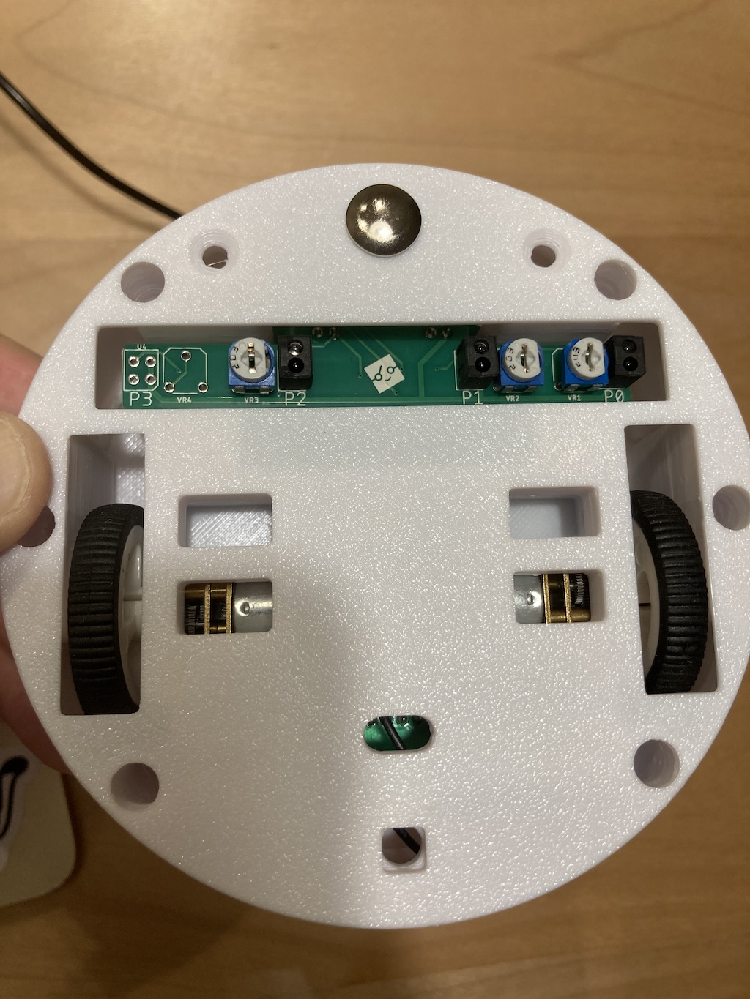

センサーの下が白だと0に近く、黒だと1023に近づきます。
下記はP0の下にラインが来るようにセッティングし、コマンドを実行したときの端末ソフトの表示です。

```
>getls
left(P0), center(P1), right(P2)
610, 53, 56
```

### モーター駆動
コマンドdrivemotorはモーターを駆動します。
1つ目の引数は左モーターのDuty比（%）を-100〜100で指定します。
正の数は前方向の回転、負の数は後方向へ駆動します。
2つ目の引数は右モーターのDuty比（%）です。パラメータは左モーターと同じです。
3つ目の引数はモーターの駆動時間をmsで指定します。

コマンドの実行例を示します。

下記のコマンドは左モータDuty=30%、右モーターDuty=30%で500ms間前進します。
```
>drivemotor 30 30 500
left duty = 30 (%), right duty = 30 (%), drive time = 500 (ms)
```

下記のコマンドは左モータDuty=30%、右モーターDuty=0%で500ms間左に回ります。
```
>drivemotor 30 0 500
left duty = 30 (%), right duty = 0 (%), drive time = 500 (ms)
```

下記のコマンドは左モータDuty=0%、右モーターDuty=30%で500ms間右に回ります。
```
>drivemotor 0 30 500
left duty = 0 (%), right duty = 30 (%), drive time = 500 (ms)
```

### ボタン押下状態取得
コマンドgetbtnはmicro:bitのA、B、LOGOの各ボタンの押下状態を取得します。

Aボタンを押している時にコマンドを実行したときは以下になります。
```
>getbtn
Button_A: on , Button_B: off, Button_LOGO: Not touched
```

Bボタンを押している時にコマンドを実行したときは以下になります。
```
>getbtn
Button_A: off, Button_B: on , Button_LOGO: Not touched
```

micro:bitのLOGOをタッチしている時にコマンドを実行したときは以下になります。
```
>getbtn
Button_A: off, Button_B: off, Button_LOGO: Touched
```


### 加速度センサー値の取得
コマンドreadaccgは加速度センサーの値を取得します。
表示された値は左からx軸, y軸, z軸の重力加速度です。

```
>readaccg
-0.044000,-1.036000,-0.004000
```

### メモリ リード・ダンプ表示
コマンドmrはメモリ リード・ダンプ表示ができます。

メモリリードはデバッグ時にレジスタの確認の用途などに使えるかと思います。
デバイスIDのレジスタをコマンドで確認する例を示します。
コマンドgetdevidでデバイスIDを読み出してみます。

※デバイスIDは架空の値に変更しています。

```
>getdevid
This devid_0_1: 44332211_88776655
```
デバイスID 0が0x44332211、デバイスID 1が0x88776655でした。

デバイスIDですが以下の仕様でレジスタに格納されています。
* デバイスID 0はレジスタDEVICEID[0]、アドレス0x10000060に4バイトで格納されている。
* デバイスID 1はレジスタDEVICEID[1]、アドレス0x10000064に4バイトで格納されている。<br>
参考）[FICR — Factory information configuration registers](https://docs.nordicsemi.com/bundle/ps_nrf52833/page/ficr.html)

以下はデバイスID 0を0x10000060から4バイト指定（w）で読み出すメモリリードコマンドです。

```
>mr w 0x10000060
10000060  44332211
```

以下はデバイスID 1を0x10000064から4バイト指定（w）で読み出すメモリリードコマンドです。
```
>mr w 0x10000064
10000064  88776655
```

デバイスID読み出しコマンドとメモリリードの結果が同じになることが確認できます。


以下はデバイスID 0を0x10000060から1バイト指定（b）で4バイト分、読み出すメモリリードコマンドです。
```
>mr b 0x10000060 4
10000060  11 22 33 44
```

以下はデバイスID 1を0x10000064から1バイト指定（b）で4バイト分、読み出すメモリリードコマンドです。
```
>mr b 0x10000064 4
10000064  55 66 77 88
```

以下は0x10000060から1バイト指定（b）で8バイト分、読み出します。
以下の表示になります。

```
>mr b 0x10000060 8
10000060  11 22 33 44 55 66 77 88
```

デバイスID 0, 1を8バイトで表示しています。

### 強化学習のQtable設定
強化学習のQtableを以前強化学習したものに戻したり、いろいろ試行錯誤したい場合があるかと思いました。
Qtableを動的に変更するコマンドがrlsetqtblです。

rlコマンドで強化学習が完了時に以下が端末ソフトに表示されます。

```
rl_learning_task() trial count = 1000.
Qtable[0][0] = -473.137268
Qtable[0][1] = -574.839478
Qtable[0][2] = -193.743423
Qtable[1][0] = -113.157005
Qtable[1][1] = -108.166664
Qtable[1][2] = -89.119911
Qtable[2][0] = -72.646233
Qtable[2][1] = -33.338005
Qtable[2][2] = -106.562347
Qtable[3][0] = -654.267578
Qtable[3][1] = -656.989014
Qtable[3][2] = -667.952393

rlsetqtbl command setting format
rlsetqtbl -473.137268 -574.839478 -193.743423 -113.157005 -108.166664 -89.119911 -72.646233 -
33.338005 -106.562347 -654.267578 -656.989014 -667.952393
rl_learning_task() enter tk_wai_flg() waiptn = RL_START
```

以下の部分がrlsetqtblコマンドのフォーマットになります。

※-の後で改行されているので実際にコマンドを送信するときは改行しないよう整形します。
コマンド名rlsetqtblの後ろにQtableの2次元配列を昇順にスペース区切りで指定しています。

```
rlsetqtbl -473.137268 -574.839478 -193.743423 -113.157005 -108.166664 -89.119911 -72.646233 -
33.338005 -106.562347 -654.267578 -656.989014 -667.952393
```

実際にrlsetqtblでQtableの変更をおこなってみます。
まず現在設定されているQtableをrloutqtblコマンドで確認します。

```
>rloutqtbl
Qtable[0][0] = -49.403526
Qtable[0][1] = -97.823532
Qtable[0][2] = -113.177238
Qtable[1][0] = -113.157005
Qtable[1][1] = -108.166664
Qtable[1][2] = -89.119911
Qtable[2][0] = -72.646233
Qtable[2][1] = -33.338005
Qtable[2][2] = -106.562347
Qtable[3][0] = -129.607758
Qtable[3][1] = -142.625000
Qtable[3][2] = -164.059372

rlsetqtbl command setting format
rlsetqtbl -49.403526 -97.823532 -113.177238 -113.157005 -108.166664 -89.119911 -72.646233 -33.338005 -106
.562347 -129.607758 -142.625000 -164.059372
```

rlsetqtblでQtableを変更します。

```
rlsetqtbl -473.137268 -574.839478 -193.743423 -113.157005 -108.166664 -89.119911 -72.646233 -33.338005 -106.562347 -654.267578 -656.989014 -667.952393
```

Qtableが変更されたかrloutqtblコマンドで確認します。

```
>rloutqtbl
Qtable[0][0] = -473.137268
Qtable[0][1] = -574.839478
Qtable[0][2] = -193.743423
Qtable[1][0] = -113.157005
Qtable[1][1] = -108.166664
Qtable[1][2] = -89.119911
Qtable[2][0] = -72.646233
Qtable[2][1] = -33.338005
Qtable[2][2] = -106.562347
Qtable[3][0] = -654.267578
Qtable[3][1] = -656.989014
Qtable[3][2] = -667.952393

rlsetqtbl command setting format
rlsetqtbl -473.137268 -574.839478 -193.743423 -113.157005 -108.166664 -89.119911 -72.646233 -33.338005 -1
06.562347 -654.267578 -656.989014 -667.952393
```

変更後のQtableになっていることを確認できました。
